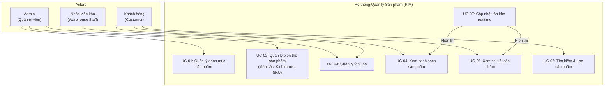

# ĐẶC TẢ YÊU CẦU PHẦN MỀM (SRS)
## Chức năng: [2.1] Quản lý Sản phẩm (PIM) – Kochi Lens

---

## Phần 1: Mô hình hóa quy trình (Business Flow)

### 1.1. Sơ đồ Use Case

**Mục tiêu:** Xác định các tác nhân (Actor) tương tác với hệ thống và các chức năng chính liên quan đến quản lý sản phẩm.



#### 1.1.1. Mô tả Actors:
| Actor | Vai trò | Mô tả |
| :--- | :--- | :--- |
| Admin | Quản trị viên hệ thống | Chịu trách nhiệm tạo, cập nhật, xóa sản phẩm, danh mục, biến thể (màu sắc, kích thước) và nhập kho ban đầu. |
| Customer | Người mua hàng (B2C/B2B)	 | Tìm kiếm, xem danh sách, xem chi tiết sản phẩm và kiểm tra tồn kho trước khi đặt hàng. |
| Warehouse Staff | Người quản lý kho | Cập nhật số lượng tồn kho thực tế, xử lý nhập/xuất kho điều chỉnh. |

### 1.2. Sơ đồ Activity
```mermaid
graph TD
    Start([Bắt đầu]) --> A[Truy cập website]
    A --> B[Tìm kiếm/Sản phẩm]
    B --> C{Chọn sản phẩm}
    C --> D[Chọn biến thể: Màu sắc, Kích thước]
    D --> E[Hệ thống kiểm tra tồn kho realtime]
    E --> F{Tồn kho > 0?}
    F -- Không --> G[Hiển thị "Hết hàng"]
    G --> C
    F -- Có --> H[Hiển thị số lượng tồn, giá]
    H --> I[Thêm vào giỏ hàng]
    I --> J{Xem giỏ hàng?}
    J -- Có --> K[Hiển thị giỏ hàng\n Cập nhật số lượng]
    K --> L[Tính toán phí ship, thuế]
    L --> M[Tiến hành thanh toán]
    M --> N{Chọn phương thức}
    N --> O[VNPay / MoMo]
    O --> P[Thanh toán thành công]
    P --> Q[Hệ thống tạo Sale Order]
    Q --> R[Trừ tồn kho realtime]
    R --> End([Kết thúc])
    J -- Không --> I
```
#### 1.2.1. Giải thích luồng quan trọng:
1. Kiểm soát biến thể: Khách hàng không thể thêm sản phẩm vào giỏ nếu chưa chọn đầy đủ màu sắc/kích thước.
2. Tồn kho Realtime: Tại bước E và R, hệ thống phải lock stock để tránh tình trạng "bán quá số lượng tồn" khi nhiều người đặt cùng lúc.
3. Phân biệt Draft Order vs Sale Order: Khi khách hàng chọn sản phẩm, hệ thống tạo Draft Order (giỏ hàng). Khi thanh toán thành công qua VNPay/Momo, Draft Order chuyển thành Sale Order và tồn kho bị trừ chính thức.

## Phần 2: Đặc tả chức năng (Functional Requirements)
### 2.1. Quản lý danh mục sản phẩm
PIM-US01 – Là một Admin, tôi muốn tạo danh mục sản phẩm với cấu trúc phân cấp (cha-con) để tổ chức sản phẩm khoa học và dễ quản lý.
PIM-US02 – Là một Admin, tôi muốn chỉnh sửa thông tin danh mục để cập nhật khi có thay đổi về cấu trúc kinh doanh.
PIM-US03 – Là một Admin, tôi muốn gán thuộc tính đặc trưng cho từng danh mục (ví dụ: độ phân giải, cảm biến, tiêu cự) để khi tạo sản phẩm mới, hệ thống tự động gợi ý các thuộc tính cần nhập.
PIM-US04 – Là một Khách hàng, tôi muốn xem danh sách sản phẩm theo danh mục để dễ dàng tìm thấy sản phẩm mình quan tâm.

### 2.2. Quản lý sản phẩm & biến thể
PIM-US05 – Là một Admin, tôi muốn tạo sản phẩm mới với đầy đủ thông tin (tên, mô tả, hình ảnh, video, thương hiệu, tags SEO) để khách hàng hiểu rõ về sản phẩm trước khi mua.
PIM-US06 – Là một Admin, tôi muốn quản lý biến thể sản phẩm theo màu sắc và kích thước, mỗi biến thể có SKU, giá, hình ảnh riêng để đáp ứng nhu cầu đa dạng của khách hàng.
PIM-US07 – Là một Admin, tôi muốn cấu hình giá B2B riêng cho từng biến thể theo hạng thành viên (Đồng, Bạc, Vàng) để phục vụ khách hàng doanh nghiệp.
PIM-US08 – Là một Khách hàng, tôi muốn xem chi tiết sản phẩm với tất cả các biến thể, hình ảnh thay đổi khi chọn màu, hiển thị tồn kho và giá chính xác để lựa chọn phù hợp.
PIM-US09 – Là một Khách hàng, tôi muốn tìm kiếm sản phẩm theo từ khóa và lọc theo danh mục, giá, thương hiệu, màu sắc, kích thước, thuộc tính đặc trưng để nhanh chóng tìm được sản phẩm mong muốn.

### 2.3. Quản lý tồn kho & hiển thị realtime
PIM-US10 – Là một Admin, tôi muốn nhập kho ban đầu cho từng biến thể với số lượng và giá vốn để hệ thống có dữ liệu tồn kho chính xác khi bán hàng.
PIM-US11 – Là một Nhân viên kho, tôi muốn cập nhật tồn kho khi nhập hàng mới hoặc điều chỉnh do hư hỏng, mọi thay đổi đều ghi log chi tiết (người thực hiện, thời gian, số lượng cũ mới, lý do) để đảm bảo số lượng hiển thị trên web luôn chính xác.
PIM-US12 – Là một Khách hàng, tôi muốn thấy số lượng tồn kho realtime khi chọn sản phẩm để biết mình có thể mua được bao nhiêu, nếu hết hàng thì nút "Thêm vào giỏ" bị vô hiệu hóa.
PIM-US13 – Là một Nhân viên kho, tôi muốn nhận cảnh báo tự động qua email khi sản phẩm sắp hết hàng (tồn kho ≤ ngưỡng cảnh báo) để kịp thời nhập kho bổ sung.
PIM-US14 – Là một Admin, tôi muốn xem lịch sử biến động tồn kho của từng sản phẩm theo thời gian, loại biến động và người thực hiện để kiểm tra và đối soát khi có sai lệch.

### 2.4. Báo cáo tồn kho
PIM-US15 – Là một Admin, tôi muốn xem báo cáo tồn kho tổng hợp với tổng giá trị hàng tồn theo giá vốn, phân tích theo danh mục và thương hiệu, xuất được Excel để có kế hoạch nhập hàng phù hợp.

## Phần 3: Đặc tả dữ liệu (Data Schema)
### 3.1. Partner (Khách hàng)
Partner ID – Mã khách hàng duy nhất
Partner Type – Loại khách: guest (vãng lai), individual (cá nhân), company (công ty)
Full Name – Tên khách hàng hoặc người đại diện
Company Name – Tên công ty (nếu là company)
Tax Code (MST) – Mã số thuế (nếu là company, dùng xuất hóa đơn)
Email – Địa chỉ email liên hệ
Phone – Số điện thoại
Shipping Address – Địa chỉ giao hàng (đường, phường, quận, thành phố)
Billing Address – Địa chỉ xuất hóa đơn (có thể khác địa chỉ giao hàng)
Membership Level – Cấp bậc thành viên: Đồng, Bạc, Vàng (cho B2B)
Is Active – Trạng thái: active hoặc blocked
Created At – Ngày tạo

### 3.2. Product (Sản phẩm)
Sản phẩm cha
Product ID – Mã sản phẩm duy nhất
Name – Tên sản phẩm
Category ID – Danh mục sản phẩm
Brand – Thương hiệu
Status – Trạng thái: draft, published, archived
Description – Mô tả sản phẩm
Images – Hình ảnh sản phẩm

Biến thể sản phẩm
Variant ID – Mã biến thể duy nhất
Product ID – Thuộc về sản phẩm cha
SKU – Mã hàng tồn kho, duy nhất
Barcode – Mã vạch sản phẩm
Color – Màu sắc
Size – Kích thước
Regular Price – Giá bán (B2C)
Sale Price – Giá khuyến mãi
B2B Price – Giá sỉ (theo cấp bậc thành viên)
VAT Rate – Thuế suất VAT (0%, 5%, 8%, 10%)
Stock Quantity – Số lượng tồn kho hiện tại
Stock Threshold – Ngưỡng cảnh báo tồn kho
Weight – Trọng lượng (tính phí vận chuyển)
Is Active – Trạng thái kinh doanh

### 3.3. Order (Đơn hàng)
Thông tin đơn hàng
Order ID – Mã định danh duy nhất
Order Number – Số đơn hàng hiển thị (VD: KOCHI-20260327-0001)
Partner ID – Khách hàng đặt hàng
Order Type – Loại: draft (giỏ hàng), sale_order (đơn chính thức)
Status – Trạng thái: draft, confirmed, processing, shipped, delivered, cancelled
Payment Status – Trạng thái thanh toán: pending, paid, failed, refunded
Payment Method – Phương thức: vnpay, momo
Payment Transaction ID – Mã giao dịch từ cổng thanh toán

Giá trị đơn hàng
Subtotal – Tổng giá sản phẩm (chưa thuế, chưa phí ship)
VAT Amount – Tổng tiền thuế
Shipping Fee – Phí vận chuyển
Discount Amount – Tổng giảm giá
Total Amount – Tổng thanh toán

Chi tiết sản phẩm trong đơn
Order Line ID – Mã chi tiết
Variant ID – Biến thể đã mua
SKU, Product Name, Color, Size – Snapshot dữ liệu tại thời điểm mua
Quantity – Số lượng
Unit Price – Đơn giá
VAT Rate, VAT Amount – Thuế áp dụng
Total Amount – Thành tiền

Địa chỉ
Shipping Address – Địa chỉ giao hàng (tên, số điện thoại, địa chỉ chi tiết)
Billing Address – Địa chỉ xuất hóa đơn (bao gồm Company Name, Tax Code nếu có)

Lịch sử đơn hàng
Timeline – Ghi lại các lần thay đổi trạng thái (từ trạng thái cũ sang mới, thời gian, người thực hiện)